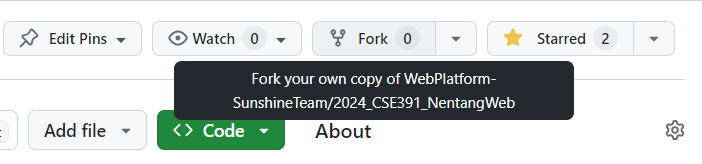
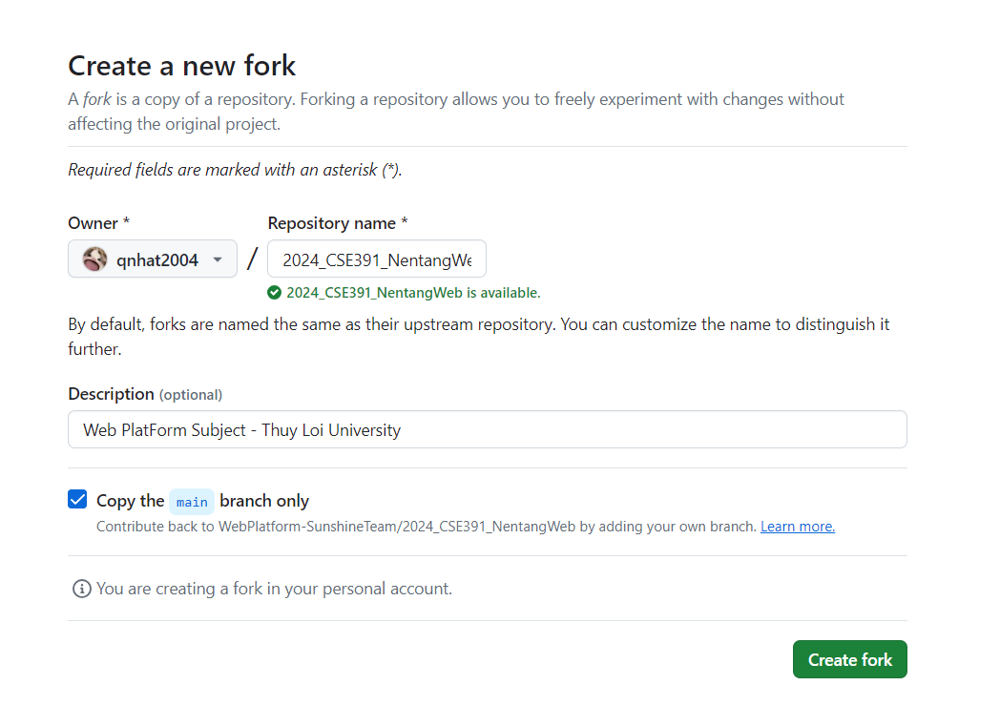

# Hướng dẫn sử dụng Git và Github
## Mục lục
- [1. Git](#1-git)
    - [Tải Git](#tải-git)
    - [Kiểm tra Git đã cài đặt thành công chưa và đang ở phiên bản nào](#kiểm-tra-git-đã-cài-đặt-thành-công-chưa-và-đang-ở-phiên-bản-nào)
    - [Cấu hình Git](#cấu-hình-git)
    - [Tạo 1 kho lưu trữ Git mới](#tạo-1-kho-lưu-trữ-git-mới)
    - [Đưa các thay đổi vào vùng chờ để commit](#đưa-các-thay-đổi-vào-vùng-chờ-để-commit)
    - [Commit các thay đổi](#commit-các-thay-đổi)
    - [Xem trạng thái của vùng chờ và thư mục làm việc](#xem-trạng-thái-của-vùng-chờ-và-thư-mục-làm-việc)
    - [Xem lịch sử commit](#xem-lịch-sử-commit)
    - [Chuyển nhánh](#chuyển-nhánh)
- [2. Github](#2-github)
    - [Tạo kho lưu trữ mới trên Github](#tạo-kho-lưu-trữ-mới-trên-github)
    - [Sao chép kho lưu trữ từ Github về máy](#sao-chép-kho-lưu-trữ-từ-github-về-máy)
    - [Liên kết kho lưu trữ trên Github với kho lưu trữ trên máy](#liên-kết-kho-lưu-trữ-trên-github-với-kho-lưu-trữ-trên-máy)
    - [Đẩy các thay đổi lên kho lưu trữ trên Github](#đẩy-các-thay-đổi-lên-kho-lưu-trữ-trên-github)
    - [Lấy các thay đổi mới nhất từ kho lưu trữ trên Github về máy](#lấy-các-thay-đổi-mới-nhất-từ-kho-lưu-trữ-trên-github-về-máy)
    - [Tạo Pull Request](#tạo-pull-request)
    - [.gitignore](#gitignore)
    - [Fork](#fork)
___
# 1. Git

## Tải Git
- [Window](https://github.com/git-for-windows/git/releases/download/v2.45.0.windows.1/Git-2.45.0-64-bit.exe)
- [Mac](https://sourceforge.net/projects/git-osx-installer/files/git-2.25.0-intel-universal-mavericks.dmg/download)

## Kiểm tra Git đã cài đặt thành công chưa và đang ở phiên bản nào

- ### Mở Command Prompt (cmd) hoặc Terminal


- ### Kiểm tra phiên bản Git
```bash
git --version
```

- ### Kết quả trả về


## Cấu hình Git
- ### Cấu hình tên và email
```bash
git config --global user.name "Tên của bạn"
git config --global user.email "Email của bạn"
```

- ### Kiểm tra tên và email đã được cấu hình chưa
```bash
git config --global user.name
git config --global user.email
```

## Tạo 1 kho lưu trữ Git mới
```bash
git init
```

## Đưa các thay đổi vào vùng chờ để commit
```bash
git add .
```

## Commit các thay đổi
```bash
git commit -m "Nội dung commit"
```

## Xem trạng thái của vùng chờ và thư mục làm việc
```bash
git status 
```

## Xem lịch sử commit
- ### Xem lịch sử commit theo dạng danh sách
```bash
git log
```

- ### Hiển thị trên 1 dòng
```bash
git log --oneline
```

- ### Xem lịch sử commit theo đồ thị
```bash
git log --graph
```

- ### Xem lịch sử commit theo đồ thị với đầy đủ thông tin
```bash
git log --graph --oneline --decorate --all
```

## Chuyển nhánh
- ### Sau khi xem lịch sử commit, bạn sẽ thấy các phiên bản sửa đổi tại mỗi lần commit. Để chuyển về phiên bản cũ, bạn có thể di chuyển con trỏ HEAD đến phiên bản commit đó
    - #### Xem lịch sử commit và commit-id
        
    - #### Chuyển về phiên bản commit
        ```bash
        git checkout <commit-id>
        ```

- ### Tạo và chuyển sang nhánh mới
```bash
git checkout -b <branch-name>
git checkout -b <branch-name> <remote-name>    // Chuyển sang nhánh mới, tạo nhánh mới từ nhánh trên kho lưu trữ, liên kết nhánh mới với nhánh trên kho lưu trữ
```

- ### Chuyển sang nhánh khác
```bash
git checkout <branch-name>
```

- ### Tạo nhánh mới
```bash
git branch <branch-name>
```

- ### Hợp nhất nhánh vào nhánh hiện tại
```bash
git checkout main               // Chuyển sang nhánh main
git merge <branch-name>         // Hợp nhất nhánh <branch-name> vào nhánh hiện tại(main)
```

- ### Xóa nhánh
```bash
git branch -d <branch-name>
```

## 2. Github
## Tạo kho lưu trữ mới trên Github


## Sao chép kho lưu trữ từ Github về máy
- ### Sao chép đường dẫn kho lưu trữ trên Github


- ### Sao chép kho lưu trữ từ Github về máy
```bash
git clone <Đường dẫn vừa sao chép>
```

## Liên kết kho lưu trữ trên Github với kho lưu trữ trên máy
```bash
git remote add origin <Đường dẫn vừa sao chép>
```

## Đẩy các thay đổi lên kho lưu trữ trên Github
```bash
git push -u origin main
```

## Sau khi thực hiện câu lệnh trên, sau này với mỗi lần commit chỉ cần thực hiện câu lệnh sau
```bash
git push
```

hoặc chỉ định nhánh cần đẩy
```bash
git push origin <branch-name>
```

## Lấy các thay đổi mới nhất từ kho lưu trữ trên Github về máy

- ### Lấy các thay đổi về máy và hợp nhất
```bash
git pull
```

> [!NOTE] 
> `pull` gồm 2 bước: `fetch` và `merge`. `fetch` lấy các thay đổi mới nhất từ kho lưu trữ trên Github về máy, `merge` hợp nhất các thay đổi đó vào nhánh hiện tại.

- ### Lấy các thay đổi về máy mà không hơp nhất
```bash
git fetch
```

## Tạo Pull Request
- Khi muốn đề xuất thay đổi cho dự án, bạn cần tạo Pull Request để yêu cầu chủ dự án chấp nhận thay đổi của bạn.
- Ví dụ: mình làm và push thay đổi lên Github qua nhánh 'nhat', sau đó cần tạo Pull Request để yêu cầu hợp nhất vào nhánh chính (origin/main)

## .gitignore
- ### Tạo file .gitignore ở thư mục gốc của dự án
- ### Thêm các file hoặc thư mục không muốn git theo dõi vào file .gitignore
- ### Ví dụ
```
# Ignore file
*.txt
*.exe
```

## Fork
- Tạo bản sao của kho lưu trữ của người khác về kho lưu trữ của mình, sau đó thực hiện thay đổi và tạo Pull Request để đề xuất thay đổi cho người khác.

- Khác nhau giữa `clone` và `fork`
    - `clone`: Sao chép kho lưu trữ từ Github về máy, chỉ có mình mình sử dụng nên là private
    - `fork`: Sao chép kho lưu trữ từ Github của người khác về Github của mình, có thể thực hiện thay đổi và tạo Pull Request để đề xuất thay đổi cho người khác -> public

- ### Fork kho lưu trữ của người khác

- ### Đặt tên kho lưu trữ bản sao

